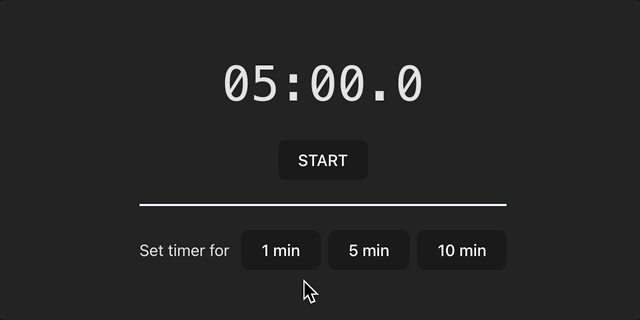
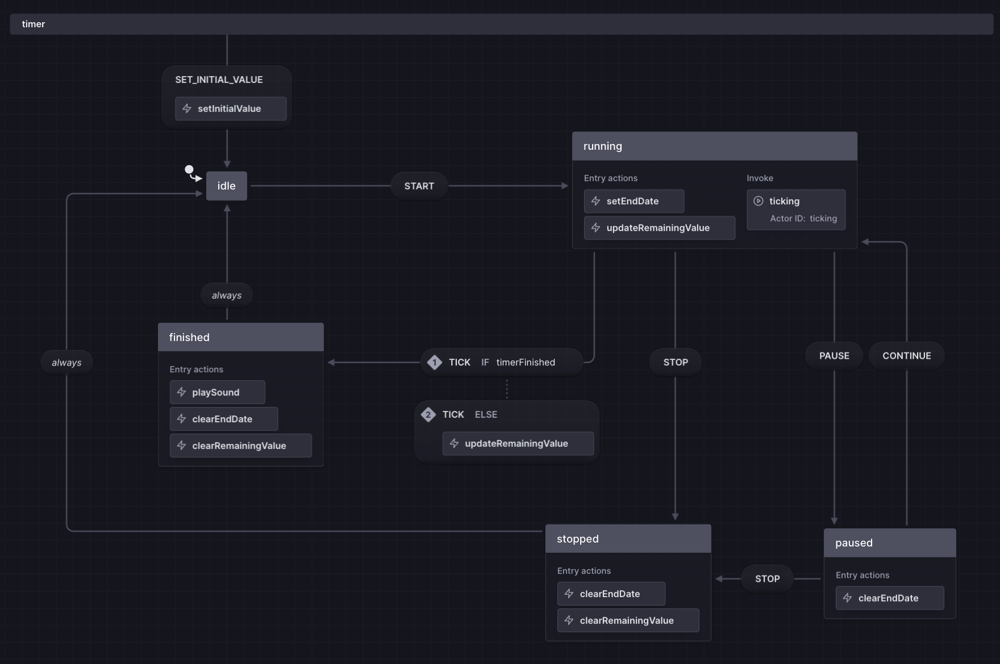

# xState timer demo

It's a simple timer app that uses [xState](https://xstate.js.org/) to manage the state of the timer. It allows user to set the timer and displays the remaining time. The timer can be paused, resumed, continued and stopped. 

## Why it's interesting
* The whole state of the timer described and managed as a state machine.
* It's a **timed** state machine. The remaining value update and ticking interval is implemented on top of the actor.
* Timer has 1/10 of the second precision, which makes it more interesting to implement.
* TODO: It may be intersting to configure some generative tests using *@xstate/graph*.

## State machine visualization with [Stately](https://stately.ai/)

